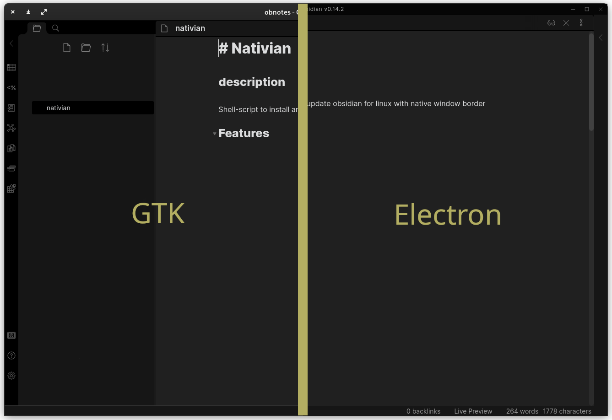
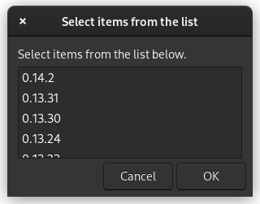
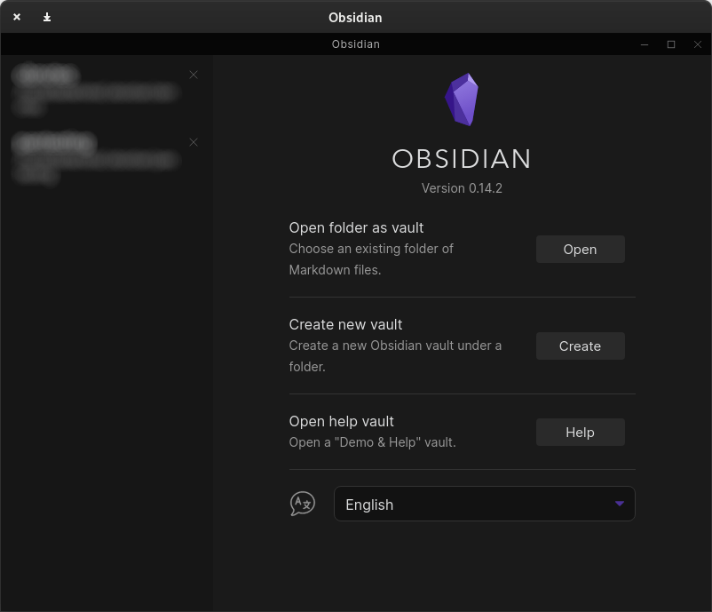

# Nativian

Nativian is a shell script which downloads obsidian appimage and automates all the steps necessary to change the frame attribute to true.

> Screenshot of obsidian on gnome 42

## Installation
> it is recommended to remove a previously installed Obsidian

To install `Nativian` do the following:
```bash
git clone git@github.com:Faetu/nativian.git
cd ./nativian
sudo bash ./installer.sh
```
Only the installer need to be run as root!

### Requirements
- npx with asar
- appimagetools

## Use

This script creates a `obsidian.desktop` file. You could start obsidian like you do it before (with menu/ulauncher/albert)
If you want to use the `version chooser` function, you have to run `rundian.sh` script on the terminal:
```bash
/usr/bin/rundian.sh -s
```
This will show the following window:



## Remove
To remove nativian, just rerun `installer.sh` as root like on installation step.
Or you could remove it manually:
```bash
# remove the application folder
rm -rf ~/.local/share/nativian
# remove the obsidian icon
rm /usr/share/pixmaps/obsidian.svg
# remove rundian, the main script of nativian
rm /usr/bin/rundian.sh
# remove the .desktop file
rm /usr/share/applications/obsidian.desktop
```
## TODO
- [x] download AppImages
- [x] set frame to native
- [x] distinguish between x86 and arm64
- [x] check for updates
- [x] version chooser
- [ ] skip version functionality (until a newer release)

## Known issues
- [ ] TWIN-FRAME: On `vault chooser` the electron frame stills shows up


